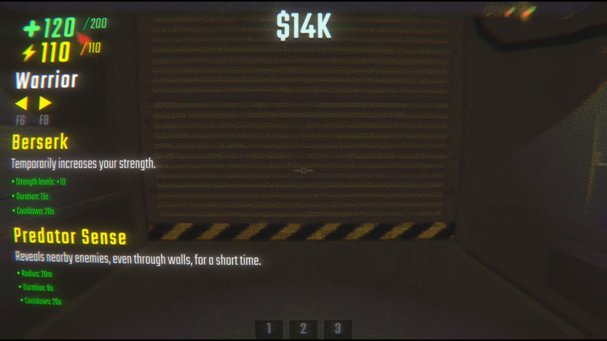
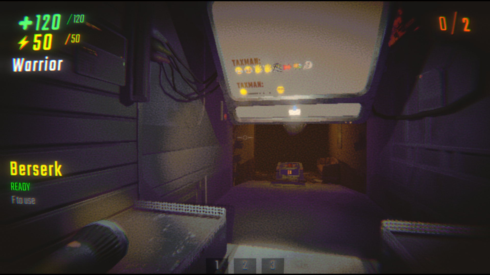

# RPG Skills Mod

Adds RPG classes to R.E.P.O., each with a unique active skill on a cooldown.

> [!WARNING]
> This plugin is currently under active development and testing.
> Features, balance, and behavior may change between versions.

## Features

- 9 playable classes, each with a unique active skill
- Cooldown system with an in-game HUD showing readiness / remaining time
- Class selection in the shop and lobby, with an in-level HUD
- Configurable keybinds and an on/off toggle (BepInEx config)
- Save compatibility: your selected class is stored per save file

## Classes & Skills

| Class | Skill | Effect |
|---|---|---|
| Warrior | Berserk | Temporarily increases your strength. |
| Druid | Nature's Blessing | Heals nearby allies within a small radius. |
| Necromancer | Raise Dead | Sacrifices your own health to revive a fallen ally nearby. |
| Assassin | Shadow Step | Become invisible and undetectable by enemies for a short time. |
| Scout | Second Wind | Grants infinite stamina for a short duration. |
| Guardian | Taunt | Forces nearby enemies to focus you. |
| Paladin | Divine Shield | Grants temporary invulnerability to all damage. |
| Blacksmith | Reinforce | Makes the item you are currently holding unbreakable. |
| Treasure Hunter | Treasure Sense | Reveals valuable items within a radius around you. |

## Controls

- F  -> Use skill
- F6 -> Previous class
- F8 -> Next class

These keybinds, as well as enabling/disabling the mod, can be changed in the BepInEx configuration file.

## Screenshots

## Contact, Bugs & Ideas

If you find a bug, have a suggestion, or want to share feedback:

- Open an issue: [GitHub Issues](https://github.com/Spefire/RPGSkillsMod_REPO/issues)
- Contact me directly via [Gmail](spefire@gmail.com) ou [Ko-fi](https://ko-fi.com/spefire)
